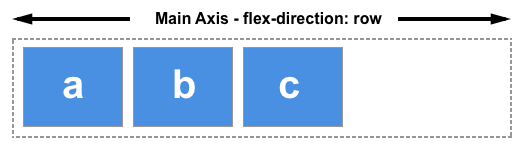
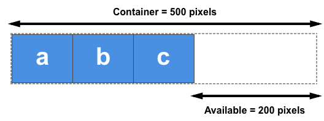

# Flexbox

## Definition

flexbox는 하나의 property가 아니라 하나의 모듈로 컨테이너(parent element)와 아이템으로 구성된다.

## two axises

flex box는 2개의 축으로 정의가 되며 `flex-direction`을 통해 `main axis`를 설정하면 다른 반대축(`cross axis`)이 정의 된다. 아래의 그림은 `main axis`를  row로 했을 때를 의미한다. 그리고 `cross axis`는 자동으로 column이 된다.

## flex container
flex box가 놓여있는 영역을 컨테이너라고 부르고 이를 생성하려면 `display`를 `flex`로 지정하면 된다. 아래의 코드는 flex box의 예시이다.

    .box{
        display: flex;

        /* row-reverse, column */
        flex-direction: row;

        /* default: nowrap = 래핑을 안하겠다 */
        /* wrap으로 바꾸면 윈도우 크기에 따라 아이템이 내려감. */
        /* wrap-reverse 등도 있음 */
        flex-wrap: nowrap;

        /* flex-direction + flex-wrap */
        /* flex-flow: column nowrap; */

        /* main axis에서 아이템을 어떻게 배치할 지  */
        /* flex-end, center, space-around, space-evenly, space-between; */
        justify-content: space-around;

        /* 반대축에서 아이템 어떻게 배치할 지 */
        /* baseline */
        align-items: center;
        align-content: space-around;
    }

**cf)** `align-items`은 반대축을 기준으로 아이템을 어디에 정렬할 지를 의미, `align-content`는 아이템이 윈도우를 넘을 때 어떻게 쌓이는 지를 의미한다.

ref) https://css-tricks.com/snippets/css/a-guide-to-flexbox/

## flex item
flex item은 컨테이너 안에 속하는 요소를 의미하며 컨테이너에 속하게 되면 저절로 flex item으로 정의된다. 아래의 그림에서 사용가능한 공간이 200픽셀을 가진다. 이 사용가능한 공간 개념은 아이템을 정렬할 때 특히 중요하다.

    .item1{
        /* default:0, 균등하게 증가 */
        /* 사용가능한 공간을 주축을 따라 분배받은 값만큼 사이즈를 차지한다.*/
        flex-grow: 1;

        /* default:0, 균등하게 감소 */
        /* 사용가능한 공간이 부족할 때 주축을 따라 분배받은 값만큼 사이즈를 줄인다.*/
        flex-shrink: 2;

        /* default: auto*/
        /* 아이템의 크기를 설정*/
        flex-basis: 30%;

        /* 위 3개를 아래처럼 쓸 수 있다.*/
        /* flex:1 2 30%; */

        align-self: flex-start;
    }