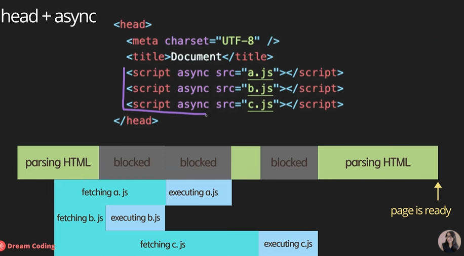
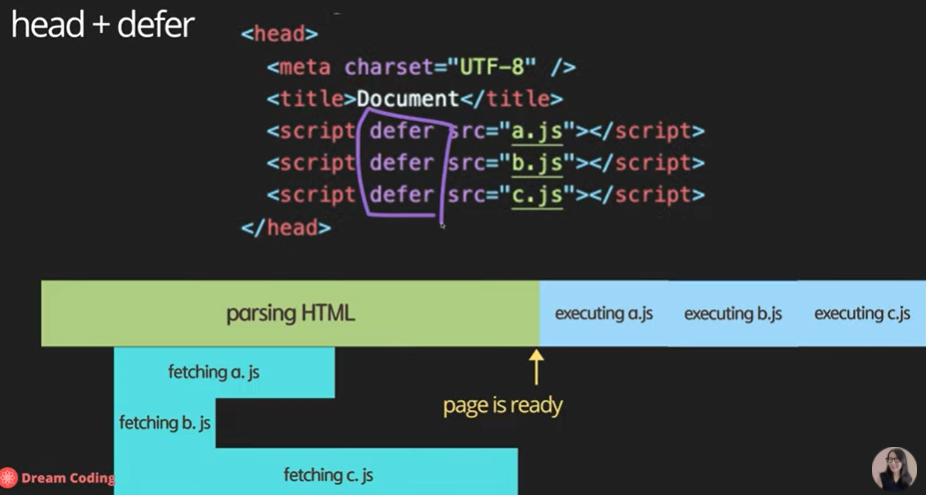

# console

console 객체는 브라우저의 디버깅 콘솔(Firefox 웹 콘솔 등)에 접근할 수 있는 메서드를 제공

```javascript
console.log("hello world");
```

<br>

# link with html file

`<script src='main.js'><script>` 처럼 자바스크립트 파일을 연결할 수 있다.

하지만 이렇게 하면 병목현상이 일어날 수 있어 `asyn`, `defer`같은 속성을 사용한다. 예시는 practice 폴더에서 확인할 수 있다.

아래의 그림들은 여러 js 파일이 있을 때 어떻게 돌아가는 지 보여준다.




<br>

## reference

https://www.youtube.com/watch?v=tJieVCgGzhs&list=PLv2d7VI9OotTVOL4QmPfvJWPJvkmv6h-2&index=2
