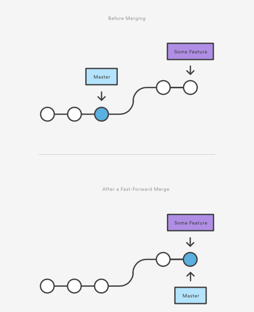
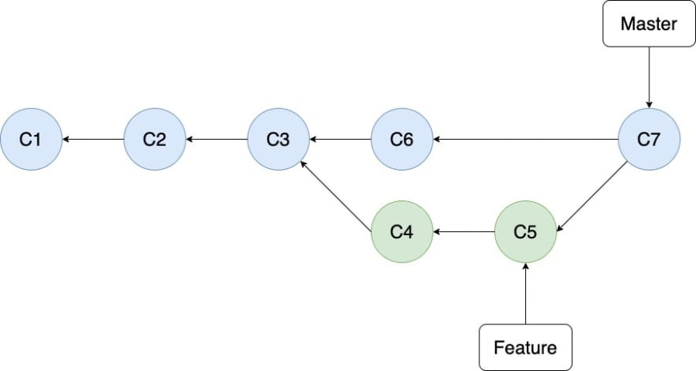

# Merge
## Outline
브랜치를 합치는 방법은 2가지로 merge, rebase가 있다. merge는 브랜치를 기반으로 실행되고 각 브랜치를 비교하여 **자동병합**한다.

merge는 크게 2가지 방법으로 나뉜다.
* Fast-Forward
* 3-way

 

## Fast-Forward
빨리 감기라는 뜻을 가지며 보통 혼자 개발할 때 사용한다. 서로 다른 브랜치이지만 순차적으로 커밋을 했기에 브랜치 경로가 일직선으로 보인다. 이때 fast forward merge를 할 수 있고 **충돌은 일어나지 않는다.**

아래 그림처럼 merge하기 위해서는 master에 HEAD를 놓고 이 명령어를 수행하면 된다. merge 이후에는 master브랜치가 some_feature 브랜치가 가리키는 커밋으로 이동한다.

    git merge some_feature
    >> commit <- {master<-HEAD, some_feature}

 

## 3-way
3-way merge의 경우 fast forward merge와는 다르게 일직선이 아닌 갈라진 형태를 가지는 경우 사용되는 merge 방법이다. merge 이후에 **새로운 커밋이 하나 생성되고 이를 병홥 커밋**이라고 한다.

이때 커밋 메세지가 자동으로 생성되는 데 이를 막기위해서는 `-e`를 사용하여 직접 수정할 수 있다.

    git merge branch_name -e

아래의 그림처럼 병합하기 위해서는 master에 HEAD를 놓고 아래의 코드를 실행하면 된다. 이후 C7이라는 커밋이 생기며 **master 브랜치가 가리키는 것을 확인할 수 있다.** 그리고 만약 이 두 브랜치가 같은 곳을 수정했으면 충돌이 발생할 수 있다.

    git merge feature

 

## Merge conflict
merge conflict가 발생하면 merge가 중단되고 직접 수정을 해야한다. **(충돌이 발생하면 직접 수정하는 수 밖에 없다.)** 이때 수정하면서 **충돌 기호는 삭제**해야한다.

충돌을 수정하면 파일은 **modified**상태가 되고 이를 `add`를 통해 스테이지에 올리고 커밋을 하면 충돌은 사라진다.

    >> merge conflict has happened.
    modify the files.
    git add files
    git commit -m "~~~"

merge를 중간에 취소하고 싶으면 `git merge --abort`를 수행하면 된다.

 

### Reference
깃 교과서