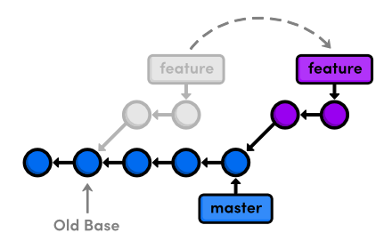

# Rebase
## Outline
브랜치를 합치는 방법은 2가지로 merge, rebase가 있다. 실무에서는 merge보다는 **커밋을 재배열**하는 리베이스를 더 선호한다. 

 

## Base
master를 제외한 모든 브랜치는 뿌리가 있다. 브랜치는 **특정 커밋을 가리키는 포인터**이다. 즉, 브랜치는 **커밋 하나를 기준으로 새로운 작업을 진행할 수 있는 분리된 작업경로**를 의미한다. 새로운 브랜치가 파생되는 커밋을 베이스라고 한다. **rebase는 파생된 브랜치의 기준이 되는 베이스 커밋**을 변경하는 것이다.

 

## Method
리베이스는 두 브랜치를 서로 비교하지 않고 **순차적으로 커밋 merge**를 시도하게 된다. 즉, 새로운 베이스에 순차적으로 커밋하는 것이라고 말할 수 있다. 이때 해시값 중복을 피하기 위해 기존 베이스에 파생된 커밋들의 **해시값과 다르게 설정**된다.

리베이스는 merge와는 다르게 파생 브랜치로 가리키고 명령어를 선언해야한다. 위의 그림처럼 하려면 feature 브랜치를 가리키고 아래의 명령어를 수행하면 된다. (외울 때 rebase to master라고 생각하면 편하다.)

    git rebase master

리베이스 이후에는 HEAD는 재정의 된 feature를 가리킨다. master 브랜치를 feature 브랜치와 merge하고 싶으면 fast forward를 이용하여 병합하면 된다.

 

## Rebase conflict
충돌이 일어나면 merge와 동일하게 사용자가 **직접 수동으로 해결**해야 한다. 수동으로 해결하고나서 스테이지 상태로 변경하고 `git rebase --continue`를 하면 된다. rebase는 충돌되는 부분이 많으면 순차적으로 이 과정을 계속 해야한다.

    >> rebase conflict has happend.
    modify the files.
    git add files
    git rebase --continue

리베이스를 수행하는 도중 취소하려면 `git rebase --abort`를 수행하면 된다.

 

### reference
깃 교과서