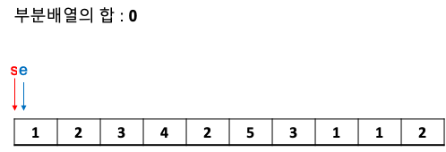
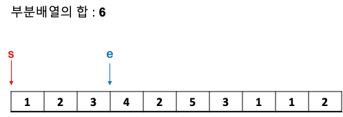
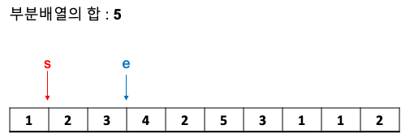

# Two pointers

리스트에 순차적으로 접근해야 할 때 **두개의 점의 위치를 기록하면서 처리**하는 알고리즘

슬라이딩 윈도우와 비슷한 원리라고 생각하면 편하다.

queue를 이용해서 구할 수도 있고 두개의 인덱스를 이용해서 처리할 수도 있다.

## 백준: 수들의 함 2
[링크](https://www.acmicpc.net/problem/2003)
```
    10 5
    1 2 3 4 2 5 3 1 1 2
```
위와 같은 입력이 주어 줬을 때 부분 합이 5가 되는 것을 찾는 문제이다.

맨처음에는 start, end 두개의 포인터가 인덱스 0을 가리키고 부분 배열의 합이 0이다.



end의 인덱스를 1증가 하고 부분합이 1이 되고 이런 방식으로 5보다 크면 start를 1 더해주는 방식




